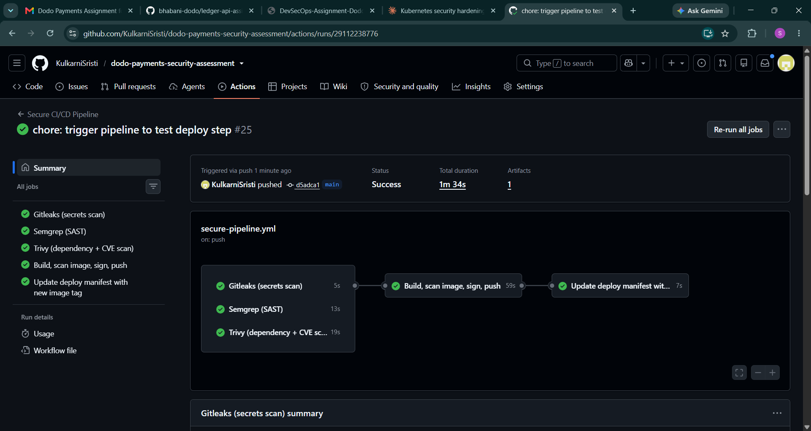

# Task 2 - Secure CI/CD Pipeline & Supply Chain + GitOps

## Pipeline: .github/workflows/secure-pipeline.yml

Gate jobs run first; build only proceeds if all three pass. On success, the image is signed, attested, and the deployment manifest is auto-updated to trigger a GitOps rollout.

| Gate | Tool | Fail Policy |
|---|---|---|
| Secrets scan | Gitleaks | Hard block on any detected secret. Allowlist (.gitleaks.toml) covers confirmed non-issues (bonus-demo insecure manifest, Sealed Secret ciphertext, deployment.yaml, Cosign verify proof JSON). |
| SAST | Semgrep (security-audit, owasp-top-ten) | Hard block on ERROR-severity findings. |
| Dependency/CVE scan | Trivy (filesystem + built image) | Hard block on CRITICAL/HIGH with a known fix. Unfixed CVEs are logged via SARIF but don't block (ignore-unfixed: true). |
| Signing | Cosign (keyless, OIDC) | Image signed post-build. |
| Provenance | Cosign attest | SLSA-style attestation attached. |
| Deploy | update-manifest job | Bumps the image tag in task1-harden-workload/deploy/04-deployment.yaml and commits back to main as github-actions[bot]. |

## Verified: full pipeline green, end-to-end

Dependencies (task1-harden-workload/app/requirements.txt) are current, non-vulnerable versions (Flask 3.1.3, PyYAML 6.0.2, requests 2.33.0, Werkzeug 3.1.6). All 5 jobs pass on a live run: Gitleaks, Semgrep, Trivy (both scans), build/sign/attest, and update-manifest.

Verified live: triggered the pipeline, all jobs passed, github-actions[bot] committed a manifest update bumping the image to a new sha-tagged ghcr.io reference, ArgoCD auto-synced the change, and the deployment rolled to the new image with zero downtime and no pod restarts.

Two intentional app-layer vulnerabilities remain in app.py by design, reserved as the Task 4 penetration-test target rather than pipeline findings:
- SSRF via /fetch?url= (suppressed with # nosemgrep + comment explaining the reservation)
- Missing auth check on GET /transactions (not a Semgrep-detectable pattern; confirmed via Task 4's pentest instead)

**Known side-effect of the dependency bump:** the /import endpoint (POST, calls yaml.load() with no Loader argument) now throws a TypeError under PyYAML 6.0+, which requires an explicit Loader. This is not referenced as a finding anywhere in Task 4's report - it was an earlier planned RCE vector that became moot once dependencies were patched to pass the Trivy gate, and was superseded by the two findings actually documented (PAN exposure, SSRF). Left as-is since patching it isn't required for any current deliverable, but noting it here for honesty rather than leaving a silently broken endpoint undocumented.

## Design decisions

- Image tags use git sha, never :latest - enforced by our own Task 1 Kyverno disallow-latest-tag policy.
- require-image-signature Kyverno policy (Task 1) is in Enforce mode, verifying Cosign signatures on application workloads. Excludes argocd and kube-system namespaces since their control-plane images aren't part of this assessment's signed supply chain (see top-level README Known Gaps for the with-more-time fix).

## GitOps - ArgoCD

argocd/application.yaml defines an ArgoCD Application pointing at this repo's task1-harden-workload/deploy path (branch: main) as the source of truth for the payments namespace, with automated: {prune: true, selfHeal: true}.

**Drift detection + self-heal - proven:**
1. Manually scaled ledger-api from 3 to 5 replicas via kubectl scale
2. ArgoCD detected the drift (Synced -> OutOfSync) and reverted to the git-declared replica count within ~7 seconds, no manual intervention
3. kubectl get application ledger-api -n argocd remained Synced/Healthy throughout

Evidence: argocd/evidence/01-argocd-sync.txt, argocd/evidence/02-drift-selfheal.txt

**Full CI -> CD -> GitOps loop - proven end-to-end:**
Pipeline run built/signed/pushed a new image, the update-manifest job committed the new tag to main, ArgoCD auto-synced it, and the deployment rolled cleanly (3/3 pods on the new image, zero restarts).

Evidence: evidence/03-cicd-gitops-loop.txt, evidence/04-rollout-complete.txt

Screenshot shows all 5 jobs passing in one run (Gitleaks, Semgrep, Trivy, Build/scan/sign/push, Update deploy manifest with new image tag) - the complete pipeline including the update-manifest job that closes the GitOps loop, not just the build/scan/sign stages.

## Known issue encountered & fixed

Our own Task 1 Kyverno disallow-root-user / disallow-latest-tag / require-image-signature ClusterPolicies initially blocked ArgoCD's own control-plane pods (e.g. dex-server, redis, notifications-controller) from being created or synced, since ArgoCD's upstream manifests don't set runAsNonRoot and aren't signed with our Cosign key. Fixed by adding namespace exclude blocks to all three policies for argocd and kube-system - cluster-wide security guardrails should exempt system/infra namespaces we don't control the manifests for, while still enforcing strictly on application namespaces like payments.

## Final gate status

- **Gitleaks**: Passes cleanly
- **Semgrep**: Passes cleanly (nosemgrep annotations correctly suppress the intentional SSRF finding reserved for Task 4)
- **Trivy**: Passes cleanly (dependencies patched to current, non-vulnerable versions)
- **Build/sign/push/attest**: Passes, verified live
- **update-manifest/deploy**: Passes, verified live end-to-end through to a completed rolling update
